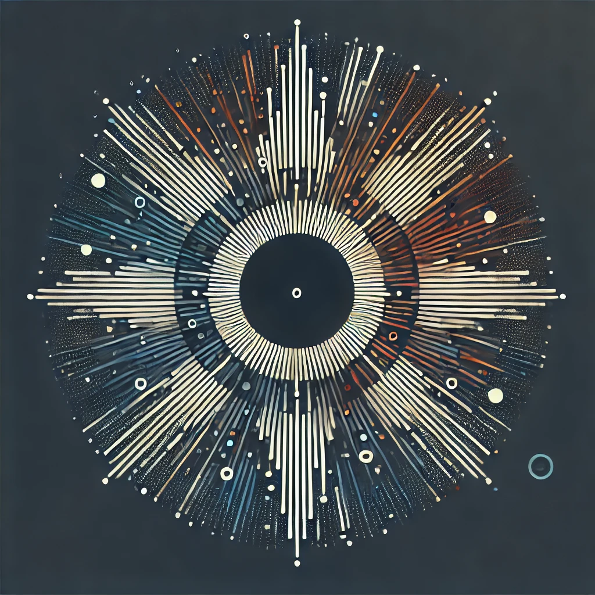

  

<h3 align="center">Benjamin Starostka Jakobsen</h3>
<h4 align="center">(Developer|Engineer|DevOps|Sport Enthusiast)</h4>

  <a href="https://starostka.io/"><strong>Go to website →</strong></a>
   
   
  <a href="https://x.com/StarostkaB">x.com</a>
  •
  <a href="mailto:info@starostka.io">E-mail</a>
  •
  <a href="https://linkedin.com/in/starostka">LinkedIn</a>

I'm a **Software/Data Engineer**, and **Sport Enthusiast** from **Denmark** who specializes in **DevOps** and highly scalable/available systems.

> I'm currently in the process of moving private projects to this public GitHub profile to showcase some of my work.

---

### Languages and Tools

 

#

### Stats

<!--  -->
